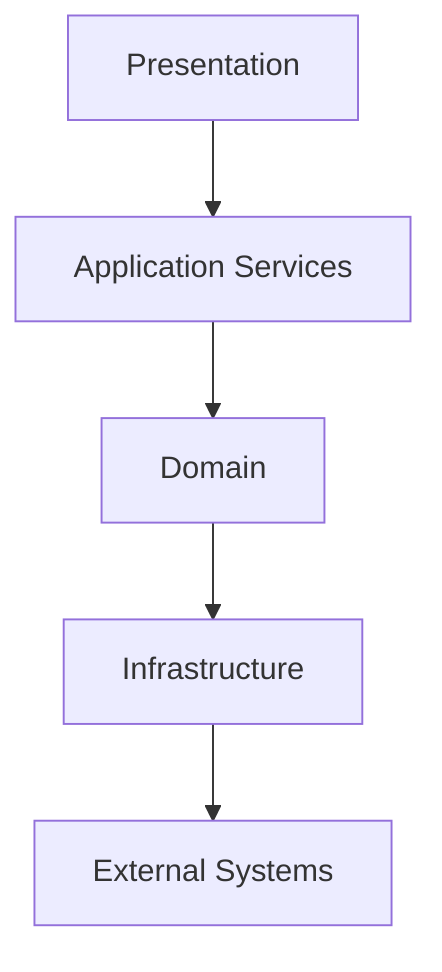

# 01. Document Control

| Property | Value |
|---|---|
| Document ID | CV-ARCH-001 |
| Version | 1.0 |
| Status | Draft Baseline |
| Project | CubeVault |
| Authority | CubeVault Constitution v1.0 |
| Category | Architecture |

## Purpose

This chapter establishes document governance for the CubeVault Architecture Guide.

## Revision Policy

Architecture documentation shall evolve through controlled revision and remain consistent with the Constitution, Project Manifest, and Engineering Standards.

## Audience

- Architects
- Developers
- Maintainers
- Contributors
- Reviewers

# 02. Purpose and Scope

## Purpose

The Architecture Guide defines the long-term structural design of CubeVault. It provides architectural guidance without prescribing implementation details.

## Scope

This guide applies to:

- Repository organization
- Component boundaries
- Layering
- Service interactions
- Extension points
- Storage architecture
- Cross-cutting concerns

## Out of Scope

The guide does not define:

- Coding conventions
- Governance processes
- Project scheduling
- Implementation-specific algorithms

Those topics are covered by their respective handbook documents.

## Design Objectives

- Maintainability
- Modularity
- Recoverability
- Extensibility
- Testability
- Security
- Performance
- Long-term sustainability

# 03. Architectural Principles

## Purpose
This chapter establishes the enduring architectural principles governing CubeVault.

## Principles
- Separation of concerns
- Modular composition
- Stable public contracts
- Explicit dependencies
- Testability by design
- Secure by default
- Configuration over hard-coded values
- Recoverability and resiliency

## Guidance
Architectural decisions should favor maintainability, clarity, and long-term evolution over short-term convenience.

# 04. System Overview

## Overview
CubeVault is a modular archive and metadata management platform organized into well-defined layers.

## High-Level Responsibilities
- Archive management
- Metadata services
- Repository abstraction
- Import and export workflows
- Configuration
- Diagnostics

## Design Intent
Each subsystem should expose stable interfaces while minimizing coupling to implementation details.

# 05. Architectural Goals

## Primary Goals
1. Reliability
2. Maintainability
3. Extensibility
4. Performance
5. Security
6. Testability

## Secondary Goals
- Predictable deployments
- Clear ownership boundaries
- Consistent engineering practices
- Long-term compatibility with future CubeVault releases

## Success Criteria
Architectural changes should improve cohesion, reduce unnecessary coupling, and preserve backward compatibility whenever practical.

# 06. Design Constraints

## Purpose
This chapter documents the architectural constraints that guide all CubeVault design decisions.

## Constraints
- Conform to the CubeVault Constitution.
- Preserve modular boundaries.
- Minimize third-party dependencies.
- Favor deterministic behavior.
- Support automated testing.
- Avoid circular dependencies.

## Rationale
Constraints encourage consistency, reduce maintenance cost, and improve long-term sustainability.

# 07. Solution Structure

## Overview
The CubeVault solution is organized into logical projects with clearly defined responsibilities.

## Structure
- Core libraries
- Storage providers
- Service layer
- User interfaces
- Tests
- Documentation
- Build tooling

## Guidelines
Dependencies shall flow inward toward the core domain and avoid unnecessary coupling.

# 08. Repository Organization

## Repository Layout

```text
/src
/tests
/docs
/tools
/build
/scripts
```

## Organization Principles
- One responsibility per project.
- Documentation versioned with source.
- Tests mirror production structure.
- Build artifacts excluded from source control.

## Expected Outcome
A predictable repository that is easy to navigate, review, and maintain.

# 09. Layered Architecture

## Purpose
CubeVault is organized into logical layers that isolate responsibilities and minimize coupling.

## Conceptual Layers
1. Presentation
2. Application Services
3. Domain
4. Infrastructure
5. External Integrations

## Rules
- Dependencies flow inward.
- Domain logic remains independent of UI and infrastructure.
- Cross-layer communication occurs through well-defined interfaces.



# 10. Domain Model

## Purpose
The domain model captures the core business concepts of CubeVault independent of implementation.

## Design Principles
- High cohesion
- Low coupling
- Explicit invariants
- Stable abstractions

## Typical Domain Concepts
- Archives
- Metadata
- Repositories
- Catalogs
- Import and Export operations

The domain model should remain independent of persistence, UI, and transport concerns.

# 11. Component Model

## Purpose
Components partition the solution into independently maintainable units.

## Characteristics
- Single responsibility
- Clear public interfaces
- Internal implementation encapsulation
- Minimal dependencies

## Component Relationships
Components communicate through contracts rather than implementation details, enabling replacement and extension without widespread change.

# 12. Storage Architecture

## Purpose
This chapter defines the conceptual storage architecture used by CubeVault.

## Objectives
- Abstract storage implementation details
- Support multiple storage providers
- Preserve data integrity
- Enable future extensibility

## Principles
- Storage is accessed through interfaces.
- Domain logic remains independent of persistence.
- Implementations may evolve without affecting consumers.

## Responsibilities
- Read and write archive data
- Persist metadata
- Manage storage lifecycle
- Support backup and recovery

# 13. Metadata Architecture

## Purpose
Metadata provides descriptive information that enables discovery, organization, and validation.

## Design Principles
- Metadata is a first-class concern.
- Schemas should be version-aware.
- Validation should occur at defined boundaries.
- Metadata should remain independent of presentation.

## Responsibilities
- Definition
- Validation
- Indexing
- Search support
- Serialization

# 14. Repository Services

## Purpose
Repository services coordinate access to CubeVault data while presenting stable contracts to higher layers.

## Responsibilities
- Repository discovery
- Archive access
- Metadata retrieval
- Search operations
- Import and export coordination

## Design Guidance
Repository services expose interfaces rather than concrete implementations, enabling testing and future replacement while minimizing coupling.

# 15. Import / Export Pipeline

## Purpose
The import/export pipeline provides a consistent mechanism for moving data into and out of CubeVault.

## Architectural Objectives
- Validate inputs before processing
- Isolate transformation logic
- Preserve data integrity
- Produce deterministic results
- Record diagnostic information

## Conceptual Flow
1. Input validation
2. Parsing
3. Transformation
4. Domain validation
5. Repository persistence
6. Result reporting


# 16. Plugin Architecture

## Purpose
CubeVault is designed to support future extensibility through well-defined extension points.

## Principles
- Interface-based contracts
- Loose coupling
- Explicit version compatibility
- Isolation of plugin failures

## Extension Areas
- Import providers
- Export providers
- Storage providers
- Metadata processors
- Diagnostics integrations

Plugins should depend only on published extension contracts.

# 17. Configuration Architecture

## Purpose
Configuration controls runtime behavior without requiring code changes.

## Sources
- Configuration files
- Environment variables
- Secret providers
- Command-line overrides where appropriate

## Principles
- Externalized configuration
- Secure defaults
- Validation at startup
- Clear precedence rules
- No hard-coded secrets

Configuration consumers should depend on abstractions rather than configuration storage mechanisms.

# 18. Logging and Diagnostics

## Purpose
Logging and diagnostics provide operational visibility into CubeVault while supporting troubleshooting and observability.

## Objectives
- Produce structured, searchable logs
- Support multiple log sinks
- Correlate related operations
- Avoid logging sensitive information

## Logging Levels
- Trace
- Debug
- Information
- Warning
- Error
- Critical

## Diagnostic Principles
- Prefer structured events over free-form text.
- Include correlation identifiers where available.
- Keep diagnostic behavior configurable.

# 19. Security Architecture

## Purpose
Security is a cross-cutting architectural concern and shall be considered throughout the system lifecycle.

## Principles
- Least privilege
- Defense in depth
- Secure defaults
- Input validation
- Secrets kept outside source code

## Architectural Guidance
Security mechanisms should be centralized where practical and exposed through well-defined interfaces.

# 20. Error Handling

## Purpose
Error handling promotes predictable behavior, recoverability, and actionable diagnostics.

## Principles
- Fail fast for invalid state
- Preserve exception context
- Do not silently ignore errors
- Log meaningful failures
- Recover only when recovery is well-defined

## Error Categories
- Validation errors
- Business rule violations
- Infrastructure failures
- Unexpected exceptions

Error handling should maintain system integrity while providing clear feedback to operators and developers.

# 21. Threading Model

## Purpose
This chapter defines the architectural approach to concurrency within CubeVault.

## Principles
- Prefer asynchronous operations for I/O-bound work.
- Keep shared mutable state to a minimum.
- Use synchronization only where required.
- Design services to be thread-safe where concurrent access is expected.

## Guidance
Concurrency decisions should prioritize correctness, predictability, and maintainability over maximum throughput.

# 22. Testing Architecture

## Purpose
Testing is an architectural capability rather than an afterthought.

## Objectives
- Enable isolated unit testing.
- Support integration testing through stable interfaces.
- Encourage dependency injection and mocking where appropriate.
- Validate end-to-end workflows.

## Architectural Guidance
System boundaries should be designed to facilitate automated testing throughout the development lifecycle.

# 23. Build and Deployment

## Purpose
The build architecture ensures that CubeVault can be built, validated, and deployed consistently.

## Principles
- Reproducible builds
- Automated validation
- Versioned artifacts
- Environment-independent build process

## Pipeline Stages
1. Restore dependencies
2. Build
3. Run automated tests
4. Perform static analysis
5. Package release artifacts
6. Publish deployment outputs

# 24. Extensibility Guidelines

## Purpose
CubeVault should evolve through stable extension points rather than modifications to core components whenever practical.

## Guidelines
- Prefer interfaces over concrete dependencies.
- Keep extension contracts versioned and documented.
- Preserve backward compatibility where feasible.
- Isolate extension failures from core services.
- Document all supported extension points.

## Design Goal
Future capabilities should be addable with minimal impact on existing functionality.

# 25. Architectural Decision Records

## Purpose
Architectural Decision Records (ADRs) preserve the rationale behind significant architectural choices.

## ADR Template
- Identifier
- Title
- Status
- Context
- Decision
- Alternatives Considered
- Consequences
- References
- Approval Date

## Guidance
Every significant architectural decision should be recorded before implementation when practical.

# 26. Glossary

| Term | Definition |
|------|------------|
| Architecture | The high-level organization of the system. |
| Component | An independently maintainable unit with a defined responsibility. |
| Domain | The core business concepts independent of infrastructure. |
| Repository | A service responsible for accessing CubeVault data. |
| Metadata | Descriptive information associated with archived content. |
| Provider | A pluggable implementation of an architectural contract. |
| ADR | Architectural Decision Record documenting a significant decision. |


